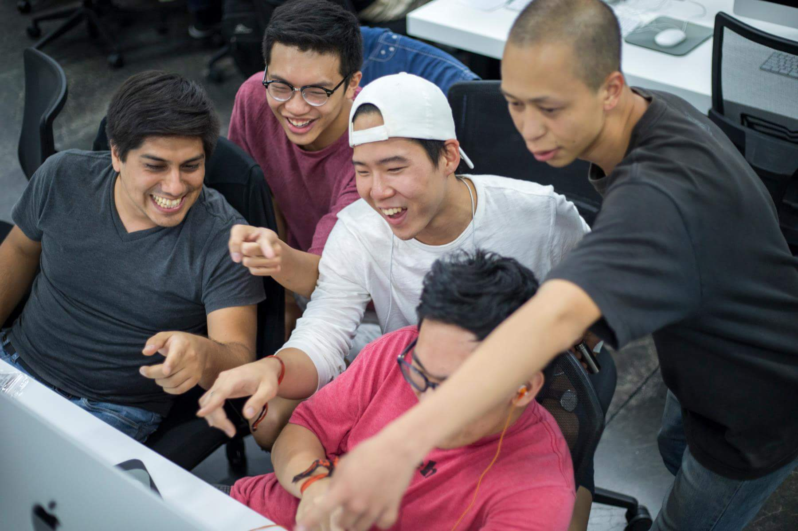

# 202407 Recurse Center

## More on Written Application

As I read more about the center, I freaked out and withdrew the application.

Thanks to Finn Clarke, who helped me un-withdrew it.

I miss this boy a lot and revised the answers to some questions on [20240720 Second Application](../20240720%20Second%20Application.md).

      

## Coding Tasks

### CracklePop

> Write a program that prints out the numbers 1 to 100 (inclusive). If the number is divisible by 3, print Crackle instead of the number. If it's divisible by 5, print Pop. If it's divisible by both 3 and 5, print CracklePop. You can use any language.
<!--  -->
> Don’t submit a CracklePop without testing it to make sure it works. This shows carelessness and doesn’t give us confidence that you can program.

```bash
python3 CracklePop.py
```

### TicTacToe

> Before your interview, write a program that lets two humans play a game of Tic Tac Toe in a terminal. The program should let the players take turns to input their moves. The program should report the outcome of the game.

```bash
python3 TicTacToe_3_PvP.py
```

```py
def startGame()
def resetGame()
def takeTurn()

def printGrid()
def markGrid()
def checkGrid()

def inputOption()
def checkOption()
```

> During your interview, you will pair on adding support for a computer player to your game. You can start with random moves and make the AI smarter if you have time.

```py
# Backend
# Add level: random
# Add level: perfect
# Add dynamic: GridNum = N

levels: {
  'random': [random],
  'easy': [center, corner, side],
  'medium': [win, block, center, oppositeCorner, corner, side],
  'perfect': [win, block, fork, blockFork, center, oppositeCorner, corner, side],
}

for strategy in levels['perfect']:

# Frontend
print("What mode to play: \"PvP\" or \"PvC\" ?")
print("What level of difficulty: \"random\", \"easy\", \"medium\" or \"perfect\" ?")
print("Who goes first: \"player\" or \"computer\" ?")
```

## Programs

- [x] CracklePop
- [x] TicTacToe_3_PvP
- [ ] TicTacToe_3_PvC_Random
- [ ] TicTacToe_3_PvC_Perfect
- [ ] TicTacToe_N

## To Do

- [ ] Add random computer
- [ ] Add perfect computer
- [ ] Add dynamic game
- [ ] Add automated testing
- [ ] Rewrite printed message in terminal
